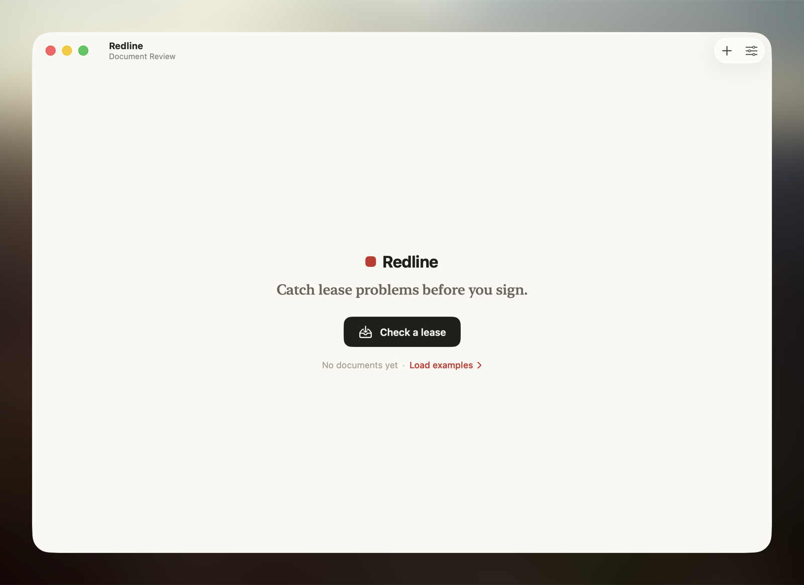

<p align="center">
  
</p>

# Redline

Redline validates commercial lease math. It extracts lease facts with a configurable model provider, then runs deterministic checks over the extracted numbers so the verdict is based on arithmetic and rule assertions, not model judgment.

The first target is the expensive template error where rent was drafted as a figure per display face when the intended deal was a total. Redline is built for local review workflows: you point it at a lease PDF, it cites the source text it used, and the deterministic rules decide whether the math holds.

## Install

With Homebrew:

```bash
brew install chountalas/tap/redline
```

This installs the CLI tools (`redline` and `redline-mcp`).

For the Mac app:

```bash
brew install --cask chountalas/tap/redline
```

The cask installs `Redline.app` into `/Applications` and depends on the CLI formula, so the GUI and terminal command use the same validator engine.

From source:

```bash
git clone https://github.com/chountalas/Redline.git
cd Redline
uv sync --extra dev --extra mcp
uv run redline check lease.pdf
```

After the Python package is published, the intended package install is:

```bash
pip install redline-lease
```

## Quickstart

```bash
uv run redline check lease.pdf
```

Codex subscription is the default provider. It uses your local `codex` CLI login and does not require an API key:

```bash
uv run redline check lease.pdf --provider codex
```

OpenAI API is separate and requires an API key plus an explicit current model:

```bash
uv sync --extra openai
export OPENAI_API_KEY=...
uv run redline check lease.pdf --provider openai --model <openai-model>
```

Local Ollama runs do not require an API key:

```bash
ollama pull gpt-oss:20b
uv run redline check lease.pdf --provider ollama --model gpt-oss:20b --base-url http://localhost:11434
```

Anthropic is available only when explicitly selected with an API key plus an explicit current model:

```bash
export ANTHROPIC_API_KEY=...
uv run redline check lease.pdf --provider anthropic --model <anthropic-model>
```

Strict CI mode fails when a rule could not verify:

```bash
uv run redline check lease.pdf --fail-on verify
```

JSON output:

```bash
uv run redline check lease.pdf --json
```

Draft-vs-deal validation:

```bash
uv run redline check lease.pdf --deal deal.yaml
```

Optional AI advisory focus, kept separate from deterministic findings:

```bash
uv run redline check lease.pdf --context "Check that the rent matches the negotiated total economics."
```

## Mac App

Redline includes a SwiftUI macOS wrapper. It uses the same Python validator engine as the CLI.

```bash
./script/build_and_run.sh
```

To install a development build into `/Applications` from a source checkout:

```bash
./script/build_and_run.sh --install
```

The app supports choosing or dropping a lease PDF, choosing an optional `deal.yaml`, entering optional deal context/focus text, choosing Codex/OpenAI/Ollama/Anthropic, and reviewing the resulting report from a native window. The API key field is runtime-only and is passed to the CLI process as `REDLINE_API_KEY`; it is not written to disk by Redline. Codex and Ollama do not need a key.

## Screenshots



## Per-Face Total Demo

Synthetic fixture:

```yaml
total_rent:
  amount: "400000"
  currency: CAD
num_display_faces: 2
```

If the lease says `$400,000 per Display Face` and also states total rent as `$400,000`, Redline emits:

```text
ERROR
- [R2_per_face_total_reconcile] Per-face rent does not reconcile to stated total
  Expected: CAD 800,000.00
  Actual: CAD 400,000.00
```

That is the core trust boundary: the selected model extracts the facts and source quotes; Redline decides whether the math holds.

## What Redline Checks

- `R1_schedule_sums_to_total`: rent schedule sums to stated total.
- `R2_per_face_total_reconcile`: per-face rent times display faces matches stated total.
- `R3_escalation_consistency`: schedule agrees with escalation clauses.
- `R4_numeral_vs_words`: numerals match spelled-out money.
- `R5_term_date_coherence`: commencement, base term, and expiry agree.
- `R6_dealsheet_match`: optional `deal.yaml` matches extracted facts.

See [docs/rules.md](docs/rules.md), [docs/dealsheet.md](docs/dealsheet.md), [docs/providers.md](docs/providers.md), [docs/mcp.md](docs/mcp.md), and [docs/mac-app.md](docs/mac-app.md).

## Privacy and Security

Do not commit real leases. The repository should only contain synthetic fixtures. Redline sends extracted lease text to the selected provider unless you use local Ollama. Use remote providers only where outbound API processing is acceptable.

Redline is not a law firm and does not provide legal advice. It is a validation tool for lease math, dates, extracted facts, and cited evidence.

See [PRIVACY.md](PRIVACY.md) and [SECURITY.md](SECURITY.md).

Before public push:

```bash
uv run python scripts/check_release_safety.py
```

## Status

Open-source alpha. Homebrew is the supported public install path. The Python package is not published to PyPI yet.
